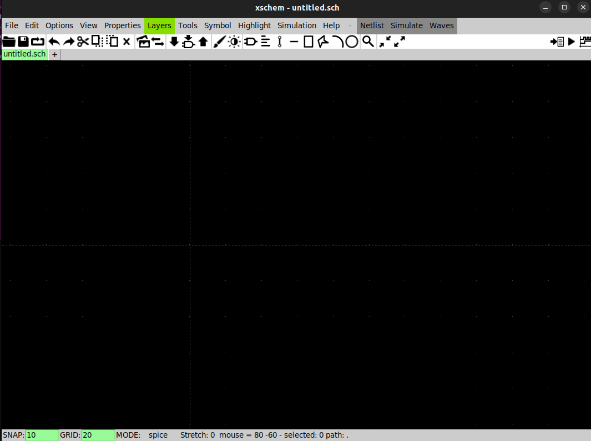

# Xschem-ngspice-sky130_PDK-Setup
A clean and minimal setup guide for integrating the SKY130 PDK with Xschem and ngspice for analog circuit design and simulation. This repository provides a reproducible environment, correct model linking, working netlist examples, and troubleshooting steps to help users avoid common setup issues and quickly start designing and verifying analog circuits using the SKY130 technology.
# System Requirement
This setup must be performed on a native Linux system. Do not use Windows or WSL for this workflow.

### Why native Linux is required

* **PDK compatibility (Sky130):**
  Many scripts and dependencies assume a native Linux filesystem. WSL can break path handling and permissions.

* **Toolchain stability:**
  Tools like Xschem, Ngspice, Magic, and Open_PDKs integrate tightly with Linux libraries. WSL often introduces GUI and dependency issues.

* **Performance:**
  Simulation and layout tools rely heavily on file I/O. Native Linux provides better performance than WSL.

* **GUI reliability:**
  Xschem and Magic require stable X11/Wayland support. WSL GUI is inconsistent.

* **Industry relevance:**
  Professional analog/VLSI environments use Linux systems, not Windows.
## Workspace Setup

Create a structured workspace in your home directory to organize all analog design files.

### Create Project Directory

```bash
mkdir ~/analog_projects
cd ~/analog_projects

mkdir circuits
mkdir layouts
mkdir models
mkdir simulations
```

### Verify Directory Structure

```bash
pwd
ls
```

Expected output:

```
/home/your-username/analog_projects
circuits  layouts  models  simulations
```

---

### Folder Purpose

* **circuits/** → Store Xschem schematic files
* **layouts/** → Store layout designs (Magic/KLayout)
* **models/** → Store Sky130 PDK files and custom models
* **simulations/** → Store Ngspice netlists and output results

---
## EDA Tools & PDK Directories

Create separate directories for tools and PDK to keep your design work isolated from installations.

### Create Directories

```bash
mkdir -p ~/eda/tools
mkdir -p ~/eda/pdk
```

---

### Final Directory Structure

```bash
/home/your-username/
│
├── analog_projects/        # Your design workspace
│   ├── circuits/
│   ├── layouts/
│   ├── models/
│   └── simulations/
│
└── eda/
    ├── tools/              # Xschem, Ngspice, Magic, etc.
    └── pdk/                # Sky130 PDK files
```
### Verify Directory Creation

Run the following command:

```bash id="r8f2kp"
ls ~/eda
```

Expected output:

```bash id="7n2lwd"
tools  pdk
```
# Ngspice Installation
Ngspice is an open-source SPICE simulator used for analog and mixed-signal circuit analysis. It supports transient, AC, DC, and noise simulations and integrates seamlessly with Xschem for schematic-driven simulation.
### Clone Ngspice Repository

```bash id="k2d9pl"
cd ~/eda/tools
git clone https://git.code.sf.net/p/ngspice/ngspice ngspice
```

---

### Verify Clone

```bash id="m8xq2n"
ls ~/eda/tools
```

Expected output:

```bash id="z7c1vo"
ngspice
```

---

### Prepare Build (Autogen + Build Directory)

```bash id="t9w4bc"
cd ~/eda/tools/ngspice
./autogen.sh

mkdir release
cd release
```

---

### What this step does

* **autogen.sh** → Generates configuration scripts required for compilation
* **release/** → Keeps build files separate from source (clean workflow)
### Fix Common Error: libtool Missing

### Problem

While running:

```bash id="h3k9df"
./autogen.sh
```

You may see this error:

```bash id="k29s8a"
You must have libtool installed to compile ngspice.
```

---

### Why this happens

Ngspice uses the **GNU build system**, which depends on `libtool` to:

* Manage shared libraries
* Generate proper build configuration files
* Complete the `autogen.sh` process

---

### Solution

Install the missing dependency:

```bash id="w7p2sl"
sudo apt install -y libtool
```

---

### Important (Do this after installing)

You **must re-run autogen**, otherwise the build will still fail.

```bash id="x91mqp"
cd ~/eda/tools/ngspice
./autogen.sh
```

---

### Expected Result

* No “libtool missing” error
* Autogen completes successfully

---

### Note

This is a **common issue**, especially on fresh Linux installations.
It does not mean anything is broken—just a missing dependency.

---
### Configure Ngspice (Critical Step)

Now configure the build with proper options.

### Run Configuration

```bash id="k91s8m"
cd ~/eda/tools/ngspice/release

../configure \
--prefix=$HOME/eda/tools/ngspice-install \
--with-x \
--enable-xspice \
--disable-debug \
--enable-cider \
--with-readline=yes
```

---

### Why this step is important

* **--prefix** → Installs Ngspice inside your home directory (avoids system pollution)
* **--with-x** → Enables GUI support
* **--enable-xspice** → Required for advanced mixed-signal models
* **--enable-cider** → Enables device-level simulation (important for analog design)
* **--disable-debug** → Faster, optimized build
* **--with-readline** → Enables command-line editing inside Ngspice

---

### Expected Result

* Configuration completes without errors
* A `Makefile` is generated inside the `release/` folder
  
  ---
### Compile Ngspice

You are now at the build stage.

### Run Compilation

```bash id="q7xk2p"
make -j4
```

---

### What this step does

* Compiles the entire Ngspice engine
* Builds device models (BSIM, etc.)
* Generates the final simulator binary

---

### Time Estimate

* Typically **5–15 minutes**, depending on your CPU performance

---

### Important Note

* `-j4` uses **4 CPU cores** for faster compilation
* You can adjust this:

  * `-j2` → slower systems
  * `-j8` → high-performance CPUs
    
    ---
    
### Install Ngspice (Local Installation)

### Run Installation

```bash
make install
```

---

### What this step does

* Copies compiled files into your defined install directory
* Does **not require sudo** (safe local install)
* Keeps your system clean (no `/usr/local` usage)

---

### Installation Location

```bash
~/eda/tools/ngspice-install/
```

---

### Directory Structure Created

```bash
ngspice-install/
├── bin/        # Main executable (ngspice)
├── lib/        # Libraries
└── share/      # Models, configs, examples
```

---

### Key File

```bash
bin/ngspice   ← main executable
```

---

## Test Ngspice Installation

Run this command:

```bash
~/eda/tools/ngspice-install/bin/ngspice -v
```

---

### Expected Output

* Ngspice version (e.g., ngspice-45+)
* Build information
* Solver details (e.g., KLU enabled)

---

## What this confirms

* Ngspice is installed correctly
* Build completed successfully
* Simulator is ready to use

---
### Verify Correct Ngspice Binary (PATH Check)

Even after successful installation, you must ensure the system is using the **correct Ngspice binary**.

---

### Run this command

```bash id="p2k8sj"
which ngspice
```

---

### Expected Result

```bash id="u9x4mn"
/home/your-username/eda/tools/ngspice-install/bin/ngspice
```

---

## Why this step is important

Even if this works:

```bash id="z1q7rt"
ngspice -v
```

…it does **not guarantee** you are using your compiled version.

---

### What can go wrong

* System may use **APT-installed Ngspice** (`/usr/bin/ngspice`)
* Your compiled version may be ignored
* This can cause:

  * Feature mismatch (missing XSPICE, CIDER, etc.)
  * Compatibility issues with Xschem
  * Debugging confusion later

---

## What we are verifying

We are checking:

👉 **Which exact binary is being executed when you type `ngspice`**

---

### Goal

Ensure:

* System points to your custom build
* Not the default system-installed version

---

## If output is wrong (important note)

If you see something like:

```bash id="l7c2vb"
/usr/bin/ngspice
```

It means your system is **not using the correct version**.

---

### Understanding Ngspice Directories (Avoid Common Confusion)

After installation, you will see **two folders named ngspice**.
They are completely different and serve different purposes.

### 1️⃣ Source Directory (Not directly usable)

```bash id="s8d2hf"
~/eda/tools/ngspice/
```

### What it contains

* Source code (`.c`, `.h`)
* Build scripts (`autogen.sh`, `configure`)
* Project files (`Makefile`, etc.)

### Example structure

```bash id="l2m9qp"
src/
Makefile
autogen.sh
```

### Important

❌ This is **NOT the simulator**

You cannot run:

```bash id="n7x3vb"
~/eda/tools/ngspice/ngspice
```

---

### 2️⃣ Installed Binary (This is your actual tool)

```bash id="k4w9zs"
~/eda/tools/ngspice-install/bin/ngspice
```

### What it contains

* Compiled executable
* Ready-to-use simulator

### This is what runs when you type:

```bash id="p9q2tm"
ngspice
```

---

### Simple Analogy

```bash id="f3h8dn"
ngspice/            → factory (where tool is built)
ngspice-install/    → finished product (what you actually use)
```

---

### Important Rule (Do not ignore)

✔ Always use:

```bash id="x1v7kc"
~/eda/tools/ngspice-install/bin/ngspice
```

❌ Never depend on:

```bash id="q6m4zr"
~/eda/tools/ngspice/
```

---

### Why both directories exist

| Directory        | Purpose                                 |
| ---------------- | --------------------------------------- |
| ngspice/         | Source code (for building/modifying)    |
| ngspice-install/ | Final installed tool (for actual usage) |

  Mixing them will lead to errors and confusion.
  
# Xschem Installation (Clone Source)
Xschem is a fast and lightweight schematic capture tool optimized for analog and mixed-signal IC design. It allows hierarchical circuit design and integrates directly with Ngspice for simulation.
### Clone Xschem Repository

```bash id="x4n8kp"
cd ~/eda/tools
git clone https://github.com/StefanSchippers/xschem.git xschem
```


### What this step does

* Downloads Xschem source code from GitHub
* Creates a new directory:

```bash id="p7d2sm"
~/eda/tools/xschem/
```

---

### Verify Clone

```bash id="m3k9we"
ls ~/eda/tools
```

Expected output:

```bash id="z8q1vt"
ngspice   ngspice-install   xschem
```

---
### Configure Xschem

Before building Xschem, we need to configure the installation path.

---
### Run Configuration

```bash id="c9k2qp"
cd ~/eda/tools/xschem
./configure --prefix=$HOME/eda/tools/xschem-install
```

---

### What this step does

* Prepares build files for compilation
* Sets installation directory to:

```bash id="m4v8sn"
~/eda/tools/xschem-install
```

---

## Build & Install Xschem

Now we compile and install Xschem.

---

### Compile Xschem

```bash id="v3k8dp"
make -j4
```

---

### What this step does

* Builds the Xschem GUI engine
* Links required libraries (Tk, Cairo, etc.)
* Generates the `xschem` executable

---

### Time Estimate

* Around **2–5 minutes** depending on your system

---

## Install Xschem

```bash id="n8q2lm"
make install
```

---

### Installation Location

```bash id="w1z7pk"
~/eda/tools/xschem-install
```

---

### Important Rules

* ❌ Do NOT use `sudo`
* ✔ Same clean install method as Ngspice
* ✔ Keeps system directories untouched

---

### What you get after installation

```bash id="c7r4tx"
xschem-install/
├── bin/        # xschem executable
├── lib/
└── share/
```

---

### Key File

```bash id="p4y9hv"
bin/xschem   ← main executable
```

---

## Add Xschem to PATH

### Open .bashrc

```bash
nano ~/.bashrc
```

---

### Add this line at the end

```bash
export PATH=$HOME/eda/tools/xschem-install/bin:$PATH
```

---

### Save and exit

* Press `CTRL + O` → Enter
* Press `CTRL + X`

---

### Apply changes

```bash
source ~/.bashrc
```

---

### Test

```bash
xschem
```

Expected: Xschem GUI opens
---

# Sky130 PDK Setup

Now we prepare a clean location for the Sky130 PDK.

---

### Create PDK Directory

```bash id="n8p2kx"
mkdir -p ~/eda/pdk
```


## Create .spiceinit File

You need to create the following .spiceinit file in the directory where simulations are run (typically ~/.xschem/simulations) or in your home directory. This file sets some default behavior for reading .lib files and speeds up loading pdk model files.

---

### Create the file

```bash id="k2m9xp"
nano ~/.spiceinit
```

---

### Add these lines

```bash id="p8d4vs"
set ngbehavior=hsa
set ng_nomodcheck
```

---

### Save and exit

* Press `CTRL + O` → Enter
* Press `CTRL + X`

---

### Why this is needed

* Improves compatibility with Sky130 models
* Avoids model checking errors
* Speeds up simulation loading

  
---

## Clone Open_PDKs (Sky130 Base)

Now we download the official Open_PDKs repository, which is required to build the Sky130 PDK.

---

### Clone Repository

```bash id="v4k8qp"
cd ~/eda/pdk
git clone git://opencircuitdesign.com/open_pdks
```

---

### What this step does

* Downloads Open_PDKs source
* Creates directory:

```bash id="n7p3dx"
~/eda/pdk/open_pdks/
```

---

### Verify Clone

```bash id="m2x9zs"
ls ~/eda/pdk/open_pdks
```

Expected output (example):

```bash id="q8r1tv"
common  configure  sky130  scripts  Makefile.in
```

---
### Configure Open_PDKs (Sky130 Only)

Now configure the build to install only the Sky130 PDK.

---

### Go to correct directory

```bash
cd ~/eda/pdk/open_pdks
```

---

### Choose which PDK to install

The `./configure` script allows you to select specific PDKs:

* **Sky130 only:**

```bash
--enable-sky130-pdk
```

* **GF180MCU only:**

```bash
--enable-gf180mcu-pdk
```

* **Both:**

```bash
--enable-sky130-pdk --enable-gf180mcu-pdk
```

---

### Run configuration (Sky130 only)

```bash
cd ~/eda/pdk/open_pdks
./configure \
--enable-sky130-pdk \
--disable-gf180mcu-pdk \
--prefix=$HOME/eda/pdk/sky130A
```

---

### What this step does

* Selects only **Sky130 PDK** (saves time & disk space)
* Sets installation path:

```bash
~/eda/pdk/sky130A
```

---

### Why these flags matter

* **--enable-sky130-pdk** → builds only Sky130
* **--prefix** → installs inside your workspace (clean setup)

---

### Build & Install Sky130 PDK

Now we build and install the Sky130 PDK.

---

### Run Build (Important: correct directory)

```bash id="n4k8ps"
cd ~/eda/pdk/open_pdks
make -j4
```

---

### What this step does

* Compiles Sky130 PDK files
* Converts raw data into tool-compatible format
* Prepares libraries for Ngspice, Xschem, Magic
* In the Open_PDKs flow, running `make -j4` performs a partial build that prepares the essential Sky130 PDK files inside the source directory (`~/eda/pdk/open_pdks/sky130/sky130A`). At this stage, all critical components required for analog simulation—such as ngspice models, device definitions, and Xschem-compatible libraries—are already generated. This means users can immediately start designing and simulating analog circuits without needing a full installation. The partial build significantly reduces system load and avoids unnecessary processing, typically limiting disk usage to roughly 20–30GB instead of growing further. Because of this, users can safely stop after `make -j4` and skip `make install`, especially if they want a lightweight and efficient setup. The `make install` step is only required if a clean, standalone PDK directory (like `~/eda/pdk/sky130A`) is needed, but it is not mandatory for normal analog design workflows.

---

### Time Estimate

* **30–90 minutes** (depends on system)
* Uses multiple CPU cores (`-j4`)

---

### Install PDK

```bash id="v2p7dx"
cd ~/eda/pdk/open_pdks
make install
```

---

### Installation Location

```bash id="k9m3qt"
~/eda/pdk/sky130A
```

---

### Important Notes

* Always run `make` and `make install` inside:

```bash id="x7d1rf"
~/eda/pdk/open_pdks
```

---

### Note
* In Open_PDKs, `make -j4` performs a partial build where the Sky130 PDK is generated inside the source directory (`~/eda/pdk/open_pdks/sky130/sky130A`) and is already usable for tools like ngspice and Xschem. This approach is lightweight, faster, and avoids downloading and processing unnecessary components, which helps save significant disk space (often preventing 20–30GB usage). In contrast, `make install` performs a full build and installation, where the processed PDK is copied to the location specified by `--prefix` (e.g., `~/eda/pdk/sky130A`). This creates a clean, standalone PDK directory but requires much more time, storage, and system resources. The folder `~/eda/pdk/sky130A` does not exist initially—it is only created after a successful `make install`. Since the partial build already provides a functional setup for analog simulation, the full installation step is optional and usually skipped unless a clean, separate PDK deployment is specifically required.

  
---

Congratulations! You have successfully set up the complete analog design environment, including Xschem, ngspice, and the SKY130 PDK. Your tools are properly configured, the models are correctly linked, and the simulation flow is working as expected. You are now ready to begin designing and simulating analog circuits using SKY130 technology.
---


# Example
  Now we will test Everything.
  * First Understand The paths
## Xschem Default Device Library

Xschem comes with a built-in library that contains all the basic components required to create schematics.

---

### Library Location

```bash
~/eda/tools/xschem-install/share/xschem/xschem_library/devices
```

---

### What you will find here

This directory includes commonly used schematic components such as:

* Voltage sources
* Current sources
* Ground (GND)
* Passive components (resistors, capacitors, etc.)
* Basic analog building blocks

---

### Usage in Xschem

When you open Xschem:

* Press **`Insert`** or use the **tool menu>insert symbol**
* Select components from the default library

---

## Sky130 PDK Device Library (MOSFETs)

This is the location of Sky130 technology devices used for real analog design.

---

### PDK Library Path

```bash id="k2p8sm"
~/eda/pdk/open_pdks/sky130/sky130A/libs.tech/xschem/sky130_fd_pr
```

---

### What you will find here

This directory contains Sky130 device symbols such as:

* **nfet_01v8** → NMOS transistor (1.8V device)
* **pfet_01v8** → PMOS transistor (1.8V device)
* Other process-specific components

---

### What these are

* These are **actual CMOS devices** from Sky130 technology
* Used for **real circuit design**, not just basic schematic symbols

---

### Why this is important

* Default Xschem library → generic components
* Sky130 PDK library → **technology-accurate devices**

👉 For analog/VLSI design, always use **PDK devices**, not generic ones

---

### Usage in Xschem

* Open tool>insert symbol
* Navigate to Sky130 library
* Select devices like `nfet_01v8`, `pfet_01v8`

---
## Using .lib (Including Sky130 Models in Simulation)

To simulate circuits using Sky130 devices, you must include the PDK model file using a `.lib` statement.

---

### Why `.lib` is required

* Ngspice needs **device models** to understand transistor behavior
* Without `.lib`, simulation will fail or give incorrect results
* It links your schematic to **real Sky130 physics (BSIM models)**

---

### Model File Path

```bash id="k3p9xn"
~/eda/pdk/open_pdks/sky130/sky130A/libs.tech/ngspice/sky130.lib.spice
```

---

### How to use in testbench / netlist

Add this line at the top of your simulation file:

```spice id="v8m2qp"
.lib ~/eda/pdk/open_pdks/sky130/sky130A/libs.tech/ngspice/sky130.lib.spice tt
```

---

### What this line means

* `.lib` → includes model library
* `sky130.lib.spice` → main Sky130 model file
* `tt` → **process corner (Typical-Typical)**

---

### Common corners

| Corner | Meaning                    |
| ------ | -------------------------- |
| tt     | Typical NMOS, Typical PMOS |
| ff     | Fast NMOS, Fast PMOS       |
| ss     | Slow NMOS, Slow PMOS       |

---

### Important Note

* This line must be present in every simulation
* Without it, MOSFETs like `nfet_01v8` will not work

---

### Key Understanding

* Xschem → draws schematic
* Ngspice → runs simulation
* `.lib` → connects schematic to real device models
---

## How to Run Simulation in Xschem

Follow these steps to simulate your circuit and verify your setup.

---

### 1. Add components

* Open Xschem
* Use the **default device library**
* Place:

  * NMOS (`nfet_01v8`)
  * Voltage sources (`VGS`, `VDS`)
  * Ground

---

### 2. Add testbench (S1 block)

* Insert a **code block (S1)**
* Paste your simulation commands (`.lib`, `.dc`, etc.)
* ```
  .lib ~/eda/pdk/open_pdks/sky130/sky130A/libs.tech/ngspice/sky130.lib.spice tt
  .dc VDS 0 1.8 0.01 VGS 0 1.8 0.6
  .save all
  .end
     ```

---

### 3. Check netlist

* Go to:
  **Simulation → Show Netlist**
* Ensure:

  * Correct device names
  * `.lib` path is correct

---

### 4. Run simulation

* Click:
  **Simulation**

* A new **xterm window** will open

---

### 5. View available signals

In the xterm, type:

```bash id="j2k8xp"
display
```

This shows all available simulation vectors (currents, voltages).

---

### 6. Plot results

Use commands like:

```bash id="x8m3qa"
First see the available vectors and then use plot command accordigly ,names maybe differ system to system
plot -I(VDS)
plot id vs Vgs
plot id vs Vds
plot V(D)
```

or based on sweep:

```bash id="p9v2kc"
plot -I(VDS) vs vds
```

---

### 7. What you should see

* Graph windows with curves (Id vs Vds, etc.)
* Multiple curves for different Vgs (if stepped)

---

## Final Check

If plots appear correctly (like shown in example):

✅ Ngspice is working
✅ Xschem integration is correct
✅ Sky130 models are properly linked

---

## Conclusion

Your analog simulation environment is now fully functional.
You can proceed to build and simulate real circuits for your projects.
